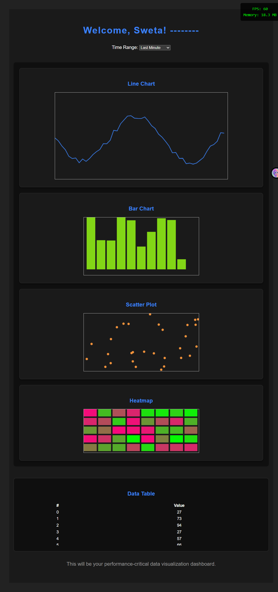

# Performance-Critical Data Visualization Dashboard

A high-performance real-time data visualization dashboard built with Vue 3 and HTML Canvas.

## Features

- **Multiple Chart Types**: Line chart, bar chart, scatter plot, and heatmap
- **Real-time Data Updates**: Charts update dynamically with simulated live data
- **Interactive Controls**: Time range selector to filter data (Last Minute/5 Minutes/Hour)
- **Virtual Scrolling Table**: Efficiently handles large datasets (1000+ rows)
- **Performance Monitoring**: Live FPS and memory usage display
- **Responsive Design**: Works on desktop, tablet, and mobile devices

## Technologies Used

- **Vue 3** - Composition API with `<script setup>`
- **Vite** - Fast build tool and dev server
- **HTML5 Canvas** - High-performance chart rendering
- **JavaScript ES6+** - Modern JavaScript features

## Setup Instructions

### Prerequisites
- Node.js 16+ and npm

### Installation

1. Clone the repository:
git clone https://github.com/swetamishra1611/performance-dashboard.git
cd performance-dashboard

2. Install dependencies:
npm install

3. Run development server:
npm run dev

4. Open in browser:
- Navigate to `http://localhost:5173`

### Build for Production
npm run build

## Project Structure

performance-dashboard/
├── src/
│ ├── components/
│ │ ├── LineChart.vue
│ │ ├── BarChart.vue
│ │ ├── ScatterPlot.vue
│ │ ├── Heatmap.vue
│ │ ├── DataTable.vue
│ │ ├── TimeRangeSelector.vue
│ │ └── PerformanceMonitor.vue
│ ├── App.vue
│ ├── main.js
│ └── style.css
├── public/
├── package.json
└── README.md

## Components Overview

### LineChart
- Real-time animated line chart
- Updates 10 times per second
- Smooth 60 FPS rendering using `requestAnimationFrame`

### BarChart
- Displays data as vertical bars
- Random data generation for demonstration

### ScatterPlot
- Visualizes data points as circles
- Random positioning for sample data

### Heatmap
- Grid-based color visualization
- Color intensity represents data values

### DataTable
- Virtual scrolling for performance
- Handles 1000+ rows efficiently
- Updates based on time range selection

### PerformanceMonitor
- Real-time FPS counter
- Memory usage tracking
- Fixed position overlay

## Author

Sweta - IIT Patna M.Tech AI

## License

This project is part of a Flam  assignment.

## Acknowledgments

Built as part of the Frontend Project assignment.
