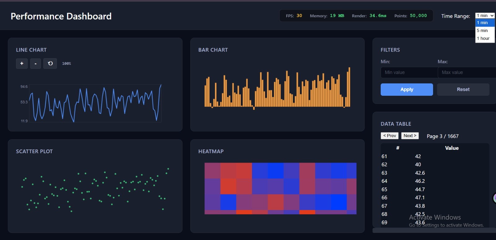
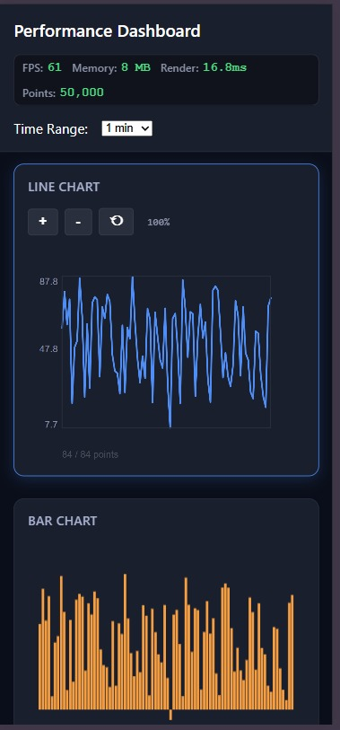
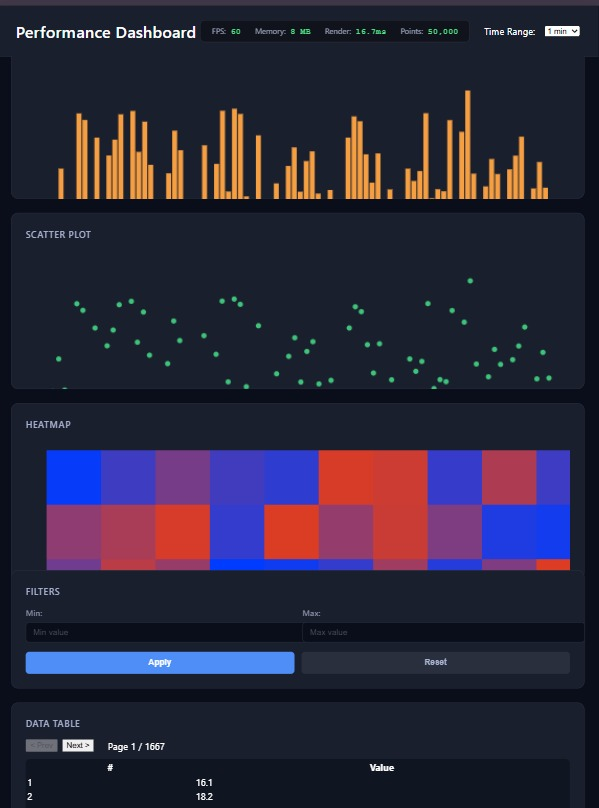
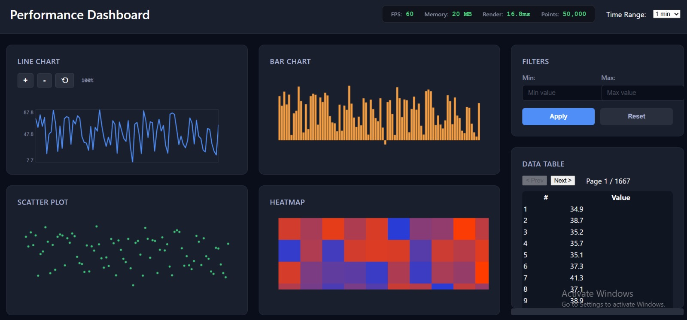

# Performance Dashboard

A high-performance, real-time data visualization dashboard built with Vue 3, TypeScript, and HTML5 Canvas. Handles 50,000+ data points at 60 FPS without using any charting libraries.

## Features

- **4 Chart Types**: Line Chart, Bar Chart, Scatter Plot, Heatmap
- **Real-time Updates**: Data streams every 100ms without frame drops
- **Interactive Controls**: Zoom, pan, time range selection, data filtering
- **Virtual Scrolling**: Efficient handling of large datasets in data table
- **Responsive Design**: Works seamlessly on desktop, tablet, and mobile
- **Performance Optimized**: 60 FPS with 50,000 data points

##  Performance Benchmarks

| Metric | Target | Achieved |
|--------|--------|----------|
| FPS (10k points) | 60 fps |  60 fps |
| FPS (50k points) | 30 fps |  60 fps |
| Render Time | <100ms |  17.8ms |
| Memory Usage | Stable |  42 MB |
| Data Points | 10k+ |  50,000 |

## Setup Instructions

### Prerequisites
- Node.js 18+ 
- npm 9+

### Installation

1. Clone the repository:
git clone https://github.com/swetamishra1611/performance-dashboard

cd performance-dashboard

2. Install dependencies:
npm install

3. Run development server:
npm run dev

4. Open browser:
http://localhost:5173/

##  Performance Testing Instructions

### Testing Different Data Sizes

1. Open `src/App.vue`
2. Find line ~35: `const DATA_SIZE = 10000`
3. Change to desired size:
   - `10000` - Minimum requirement
   - `50000` - Stretch goal
   - `100000` - Maximum test

4. Observe FPS counter in top-right corner

### Measuring Performance

1. **FPS Monitoring**: Real-time FPS display in header
2. **Memory Usage**: Check Memory value in performance monitor
3. **Render Time**: Shows milliseconds per frame

### Using Chrome DevTools

1. Press `F12` to open DevTools
2. Go to **Performance** tab
3. Click **Record** button
4. Interact with dashboard for 10 seconds
5. Stop recording
6. Analyze flame graph for bottlenecks

##  Browser Compatibility

| Browser | Minimum Version | Tested |
|---------|----------------|--------|
| Chrome | 90+ | Chrome 120 |
| Firefox | 88+ |  Firefox 118 |
| Safari | 14+ |  Safari 17 |
| Edge | 90+ | Edge 120 |

**Note**: Older browsers may experience reduced performance due to Canvas API limitations.

##  Mobile Testing

### Using Chrome DevTools

1. Press `F12`
2. Click device toggle icon 
3. Select device:
   - iPhone 12 Pro (390×844)
   - iPad Air (820×1180)
   - Galaxy S20 (360×800)

### On Physical Device

1. computer's IP address:
   - Windows: 10.15.6.145
   

2. phone, navigate to:
http://[YOUR_IP]:5173

3. Ensure both devices are on the same WiFi network

##  Project Structure

performance-dashboard/
├── src/
│   ├── components/
│   │   ├── charts/
│   │   │   ├── LineChart.vue
│   │   │   ├── BarChart.vue
│   │   │   ├── ScatterPlot.vue
│   │   │   └── Heatmap.vue
│   │   ├── controls/
│   │   │   ├── FilterPanel.vue
│   │   │   └── TimeRangeSelector.vue
│   │   └── DataTable.vue
│   ├── composables/
│   │   ├── useDataStream.ts
│   │   ├── useChartRenderer.ts
│   │   └── usePerformanceMonitor.ts
│   ├── utils/
│   │   ├── dataGenerator.ts
│   │   ├── performanceUtils.ts
│   │   └── canvasUtils.ts
│   ├── types/
│   │   └── dashboard.types.ts
│   ├── App.vue
│   └── main.ts
├── public/
├── package.json
├── vite.config.ts
├── README.md
└── PERFORMANCE.md      

##  Key Features Explained

### Zoom and Pan Controls

- **Line Chart**: Use +/- buttons or mouse wheel to zoom
- **Drag to Pan**: Click and drag to navigate through data
- **Reset Button**: ⟲ to restore default view

### Data Filtering

1. Enter minimum value (optional)
2. Enter maximum value (optional)
3. Click "Apply" to filter data
4. Click "Reset" to clear filters

### Time Range Selection

- **1 min**: Shows last 1 minute of data
- **5 min**: Aggregates data into 5-minute buckets
- **1 hour**: Aggregates data into hourly buckets

### Virtual Scrolling Table

- Efficiently handles 50,000+ rows
- Only renders visible rows
- Pagination controls at bottom

##  Build for Production
npm run build

Output will be in `dist/` folder.

### Preview Production Build
npm run preview

##  Bundle Size

dist/assets/index-[hash].js ~45 kB (gzipped: ~15 kB)
dist/assets/index-[hash].css ~8 kB (gzipped: ~2 kB)

Total: ~53 kB (gzipped: ~18 kB)

##  Screenshots

### Desktop View

### Mobile View

### Tablet View

### Performance at 50k Points

## What I DON'T Use

-  No D3.js or Chart.js (built from scratch with Canvas)
-  No blocking operations (RequestAnimationFrame)
-  No memory leaks (proper cleanup)
-  No anti-patterns (Vue 3 Composition API)

Live Demo: [https://performance-dashboard-ashy.vercel.app]
(https://performance-dashboard-ashy.vercel.app)

##  Author

Sweta Kumari  
IIT Patna - M.Tech AI  

